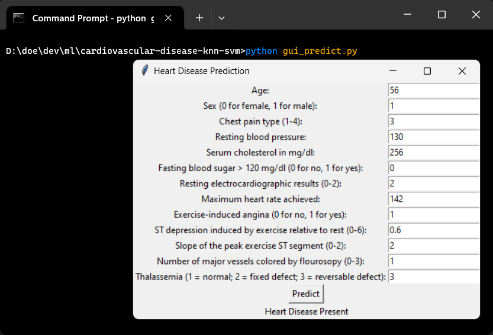
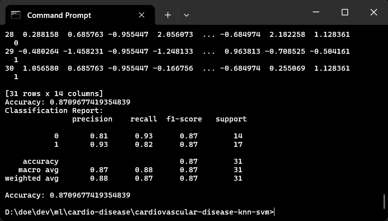

# Cardiovascular Disease Prediction
Cardiovascular Disease Prediction by user given health attributes using KNN & SVM based models

# Introduction
Cardiovascular diseases (CVDs) are the number 1 cause of death globally, taking an estimated 17.9 million lives each year, which accounts for 31% of all deaths worldwide. Heart failure is a common event caused by CVDs and this dataset contains 14 features that can be used to predict mortality by heart failure.

# Dataset
The dataset used for this project is the Cleveland Heart Disease dataset from the UCI Machine Learning Repository. The dataset contains 303 instances and 14 attributes.

# Development

### -> Create a virtual environment (Optional):

Linux: 
```bash
python3 -m venv venv
source venv/bin/activate
```

Windows:
```bash
python -m venv venv
venv\Scripts\activate
```

### -> Install the required packages:
```bash
pip install -r requirements.txt
```

### -> Run the application:
```bash
python cli_predict.py
```

[Note: You can use input references from the `sample_input.txt` file]

# Models
The following models are used for the prediction:
1. K-Nearest Neighbors (KNN)
2. Support Vector Machine (SVM)

# Results
87.1 % accuracy is achieved using KNN model and 83.9 %  using SVM model.

# Screenshots

